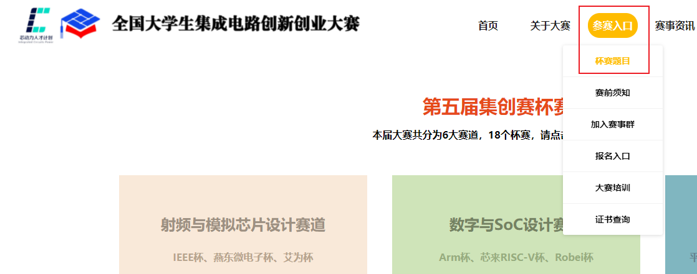

### 全国大学生集成电路创新创业大赛

- 题目参考

  http://univ.ciciec.com/col.jsp?id=134

### Innovate FPGA   Intel的项目，看起来逼格很高

- 项目介绍

https://www.innovatefpga.com/cgi-bin/innovate/teams.pl?Code=AP&Page=3

### openHW

- 一些项目介绍

  https://openhw.org/

  

### 研究生创芯大赛

https://cpipc.acge.org.cn/cw/hp/10

4月报名

### 研究生电子设计大赛

https://cpipc.acge.org.cn/cw/hp/6

### 赛灵思自适应大赛

https://www.hackster.io/contests/xilinxadaptivecomputing2021?utm_source=wechat&utm_medium=social&utm_campaign=contest_21

### 某个DPDK与FPGA结合产物  DHL

https://github.com/OpenCloudNeXt/DHL/blob/master/docs/Install.md
