## 第四次作业

### 3.4 使用Simulink对汽车自动停车系统进行仿真

##### stateflow

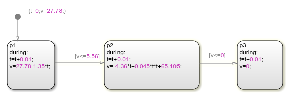

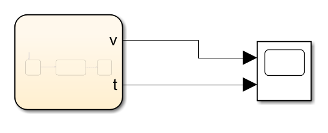

##### 仿真图

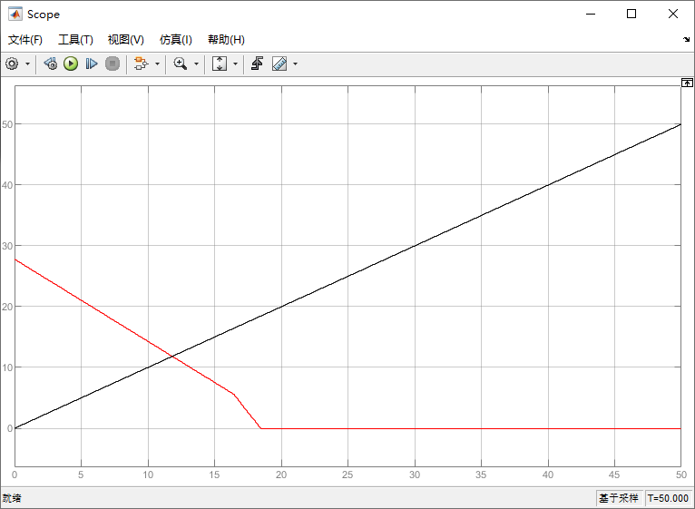

### 3.5 使用Simulink对水缸系统进行仿真

#### 初始状态1

- x1(缸1初始水量) = 0；              x2(缸2初始水量) = 1；

##### 一、速度1：v1 = 0.5;    v2 = 0.5;     w = 0.75

**stateflow图**

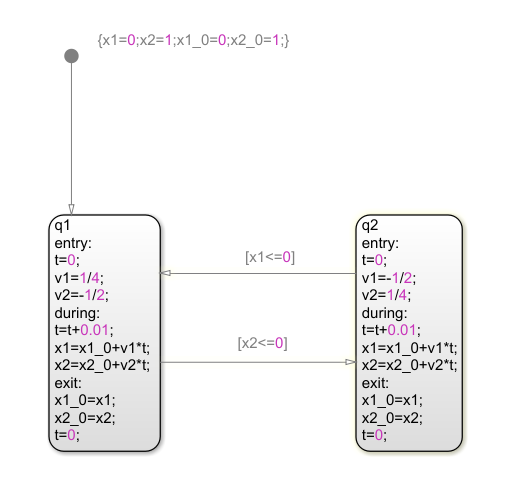

**Simulink模型图**							

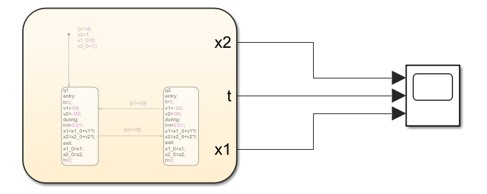

**仿真图**

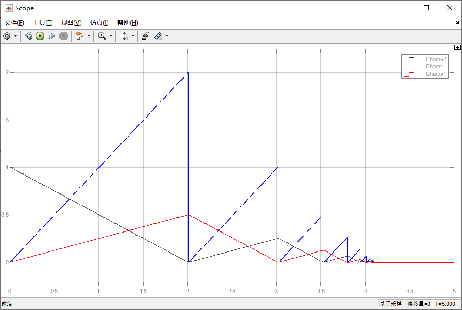

##### 二、速度2：v1 = 0.5；  v2 = 0.5；  w = 0.5

##### stateflow图

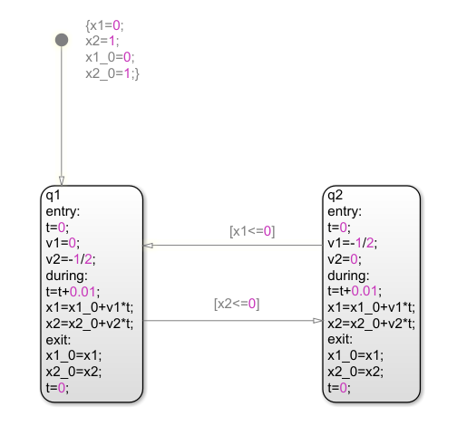

**仿真图**

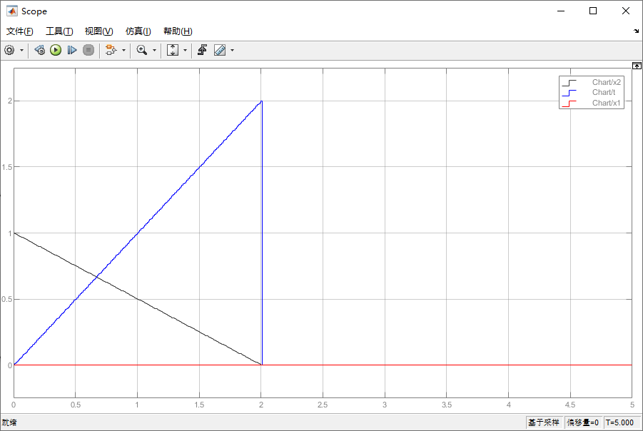

##### 三、速度3：v1 = 0.5；  v2 = 0.5；  w = 1

**stateflow图**

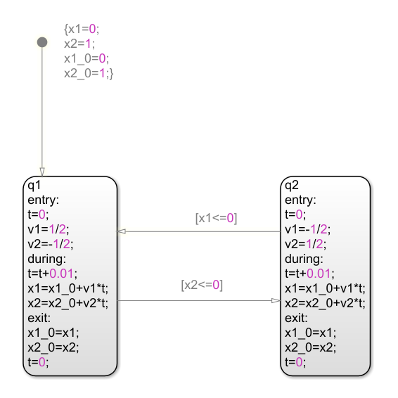

**仿真图**

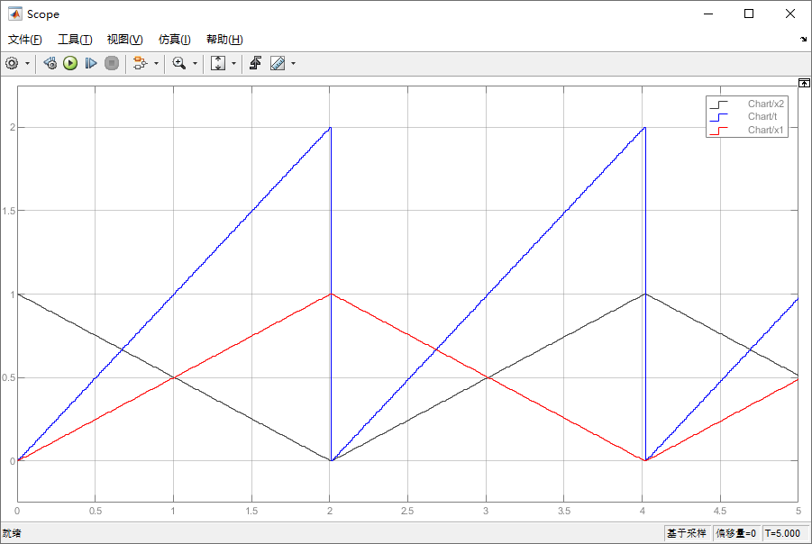

#### 初始状态2

x1(缸1初始水量) = 1；              x2(缸2初始水量) = 1；

**一、速度1：v1 = 0.5;    v2 = 0.5;     w = 0.75**

**stateflow**

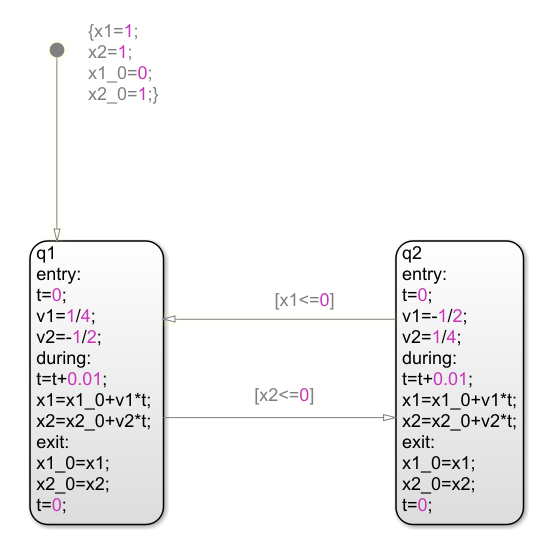

**仿真图**

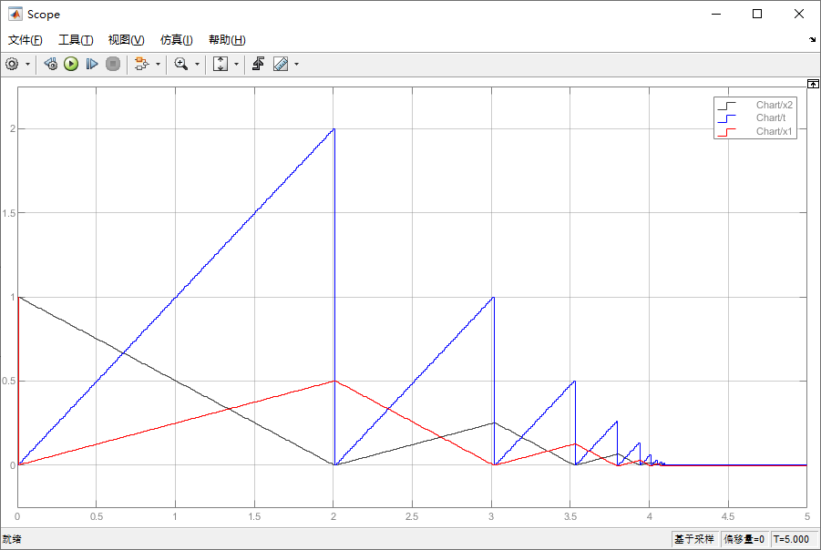

**二、速度2：v1 = 0.5;    v2 = 0.5;     w = 0.5**

**stateflow**

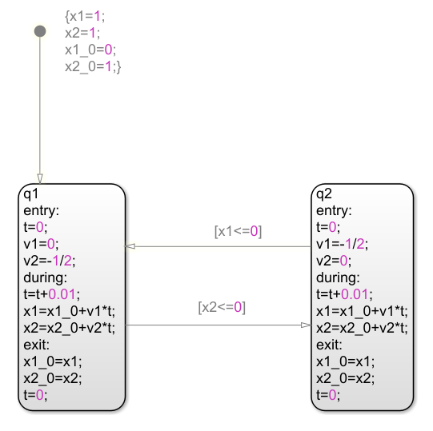

**状态图**

**三、速度3：v1 = 0.5;    v2 = 0.5;     w = 1**

**stateflow**

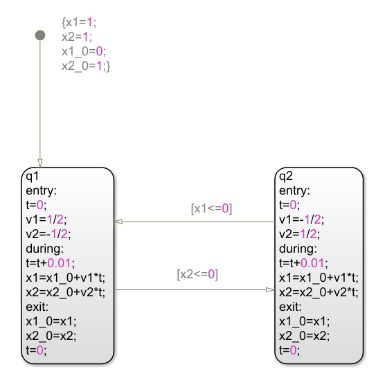

**仿真图**

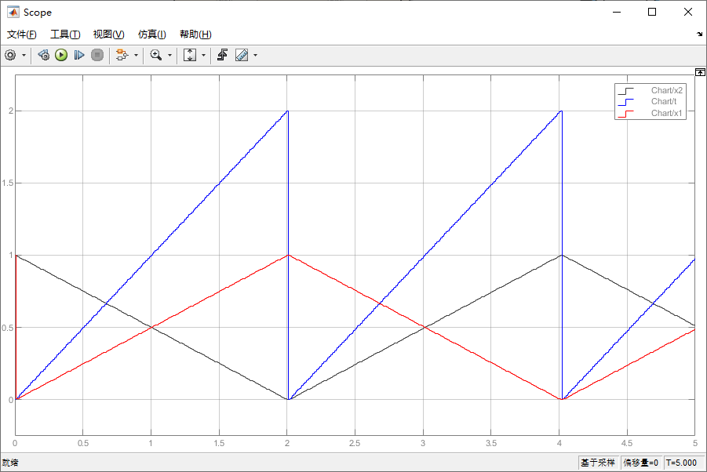

