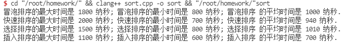
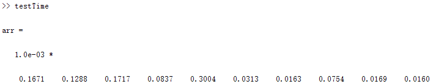
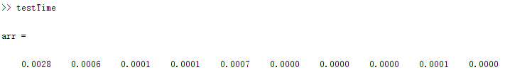
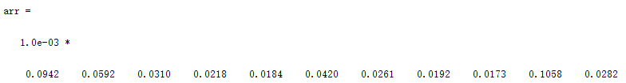
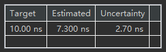
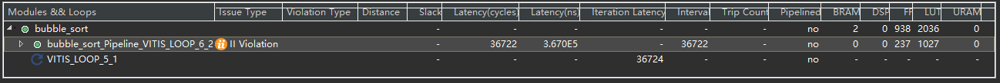
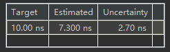
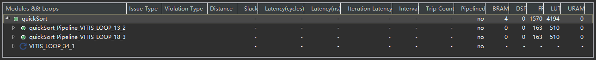
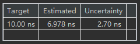
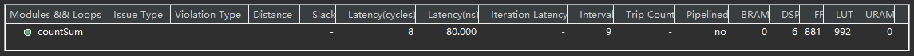

### 4.1 计算时间以及软件功耗

##### 一、（1）C++——Sort

- 源码见附件

  

###### 功耗 ： CPU ： i5-10400 @2.90GHz 为 65W

最大功耗：冒泡 = 1.17e-04w     快速 = 1.3e-04w        选择 = 9.7e-05w         插入 =  7.15e-05w

最小功耗：冒泡 = 5.2e-05w       快速 = 4.55e-05w      选择 = 5.2e-05w         插入 =  3.9e-05w

平均功耗：冒泡 = 6.5e-05w       快速 =  6.11e-05w     选择 = 6.565e-05w     插入 =  4.55e-05w

##### 一、（2）Matlab——Sort

- 源码见附件

- quickSort

- bubbleSort

##### 二、（1）C++——Sum

- 源码见附件

##### 二、(2)Matlab——Sum

- 源码见附件

### 4.2 HLS综合

使用开发板为：ZYNQ-7 ZC702 Evaluation Board     Part : xc7z020clg484-1   Family : zynq

##### 一、Sort之Bubble

- Timing

- LUT

##### 一、Sort之Quick

- Timing

- LUT

##### 二、计算和

- Timing

- LUT

##### Note : 源码见附件

### 4.3 通信传输

##### 已知 ： W=32bit，TB=20ns

**一、 N=10000Byte**

latency1 = （10000/4) * 20ns =  50ms

**二、N = 9981Byte**

latency2 = (9981/4) * 20ns = 2496 * 20ns = 49.92ms （除不尽，向上取整，需要占一个传输周期）

