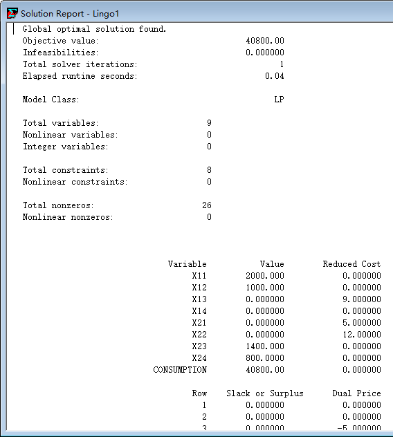
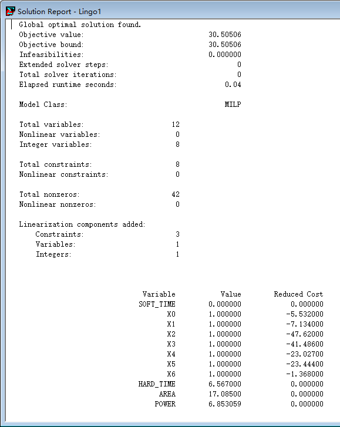
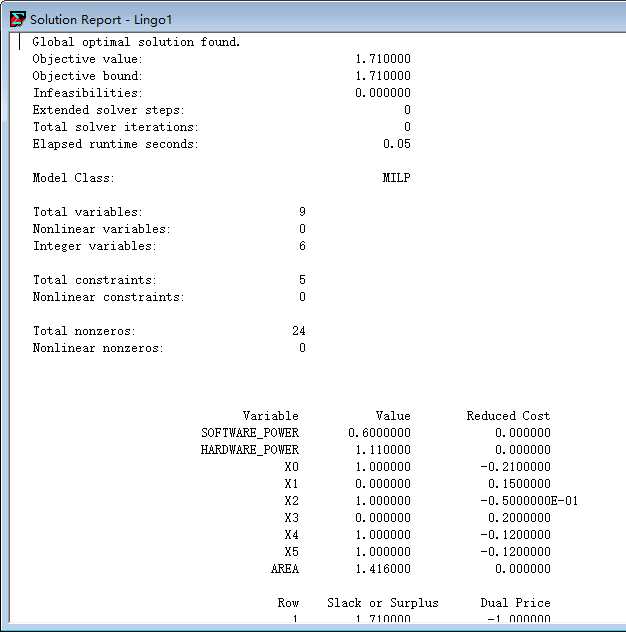
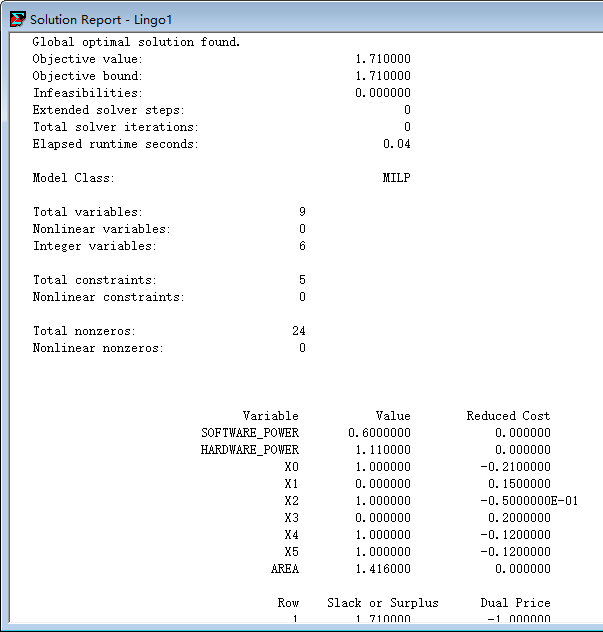
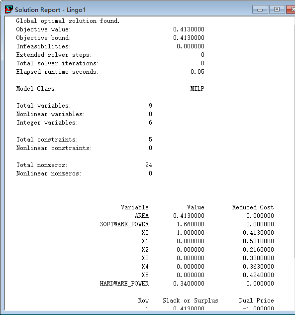
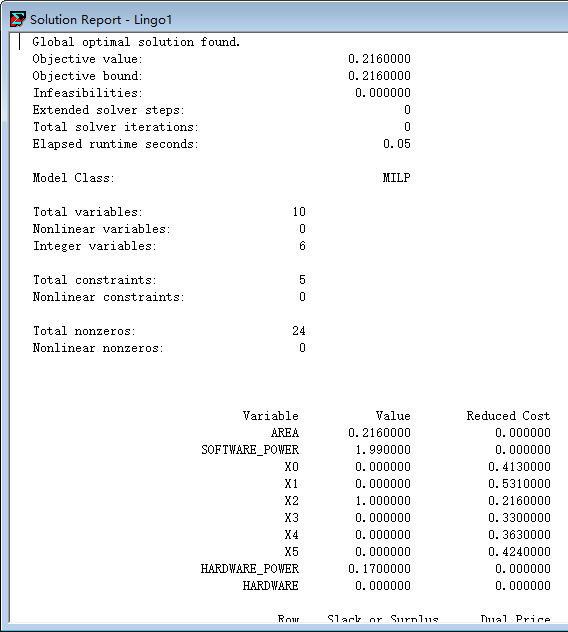
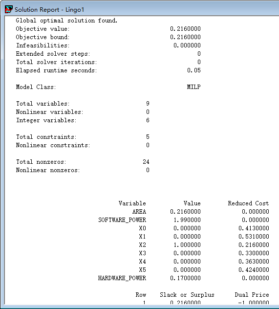
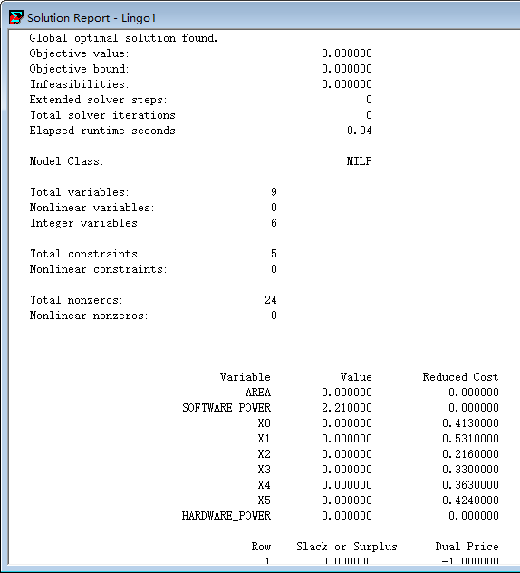

### 5.1 任务调配

线性规划代码

```
model:
x11+x12+x13+x14=3000;
x21+x22+x23+x24=2200;
x11+x21=2000;
x12+x22=1000;
x13+x23=1400;
x14+x24=800;
consumption=x11*5+x12*9+x13*16+x14*15+x21*10+x22*21+x23*7+x24*15;
min=consumption;
end
//x11
```

| x11  | x12  | x13  | x14  |
| :--: | :--: | :--: | :--: |
| 甲A  | 甲B  | 甲C  | 甲D  |

| x21  | x22  | x23  | x24  |
| :--: | :--: | :--: | :--: |
| 乙A  | 乙B  | 乙C  | 乙D  |

##### 消耗能源最省方案



甲->A ： 2000GT           甲->B ： 1000GT           甲->C ：0GT                   甲->D ： 0GT

乙->A ： 0GT                  乙->B ： 0GT                  乙->C ： 1400GT           乙->D ： 800GT


### 5.2 SM2加密算法软硬件划分

| 点加 | 倍点 | 模逆 | 模乘 | 预处理 | 点乘 | 模加减 |
| :--: | :--: | :--: | :--: | :----: | :--: | :----: |
|  X0  |  X1  |  X2  |  X3  |   X4   |  X5  |   X6   |

X <sub>i</sub> 值为1表示硬件执行，值为0表示软件执行

```
model:
soft_time = (1-x0)*11.861+(1-x1)*11.055+(1-x2)*48.949+(1-x3)*42.293+(1-x4)*23.478+(1-x5)*32.456+(1-x6)*10.020;
hard_time = x0*1.467+x1*1.038+x2*0.958+x3*0.536+x4*0.342+x5*1.231+x6*0.995;
area=x0*3.524+x1*1.881+x2*0.293+x3*0.271+x4*0.109+x5*5.581+x6*5.426;
power=x0*1.338+x1*1.002+x2*0.078+x3*0.123*x4*0.033+x5*2.2+x6*2.231;
min=soft_time+hard_time+area+power;
@bin(x0);
@bin(x1);
@bin(x2);
@bin(x3);
@bin(x4);
@bin(x5);
@bin(x6);
end
```



##### 结果

| 点加 | 倍点 | 模逆 | 模乘 | 预处理 | 点乘 | 模加减 |
| :--: | :--: | :--: | :--: | :----: | :--: | :----: |
| 硬件 | 硬件 | 硬件 | 硬件 |  硬件  | 硬件 |  硬件  |


### 5.3 车辆自动变道系统

线性规划代码

```
一、 面积限制，求功耗最小
model:
min=area;
software_power=(1-x0)*0.55+(1-x1)*0.23+(1-x2)*0.22+(1-x3)*0.37+(1-x4)*0.45+(1-x5)*0.39;
hardware_power=x0*0.34+x1*0.38+x2*0.17+x3*0.57+x4*0.33+x5*0.27;
area=x0*0.413+x1*0.531+x2*0.216+x3*0.330+x4*0.363+x5*0.424;
software_power+hardware_power<=【此处值可为2mw、2.2mw、2.5mw】;
@bin(x0);
@bin(x1);
@bin(x2);
@bin(x3);
@bin(x4);
@bin(x5);
end

二、 功耗限制，求面积最小
model:
min=software_power+hardware_power;
software_power=(1-x0)*0.55+(1-x1)*0.23+(1-x2)*0.22+(1-x3)*0.37+(1-x4)*0.45+(1-x5)*0.39;
hardware_power=x0*0.34+x1*0.38+x2*0.17+x3*0.57+x4*0.33+x5*0.27;
area=x0*0.413+x1*0.531+x2*0.216+x3*0.330+x4*0.363+x5*0.424;
area<=【此处值可为1.5mm、1.8mm、2.0mm】;
@bin(x0);
@bin(x1);
@bin(x2);
@bin(x3);
@bin(x4);
@bin(x5);
end
```


##### 面积限制1.5mm



| 信息采集模块 | 信息处理模块 | 车灯控制模块 | 车速控制模块 | 信息收集模块 | 信息发送模块 |
| :----------: | :----------: | :----------: | :----------: | :----------: | :----------: |
|     硬件     |     软件     |     硬件     |     软件     |     硬件     |     硬件     |


##### 面积限制1.8mm




| 信息采集模块 | 信息处理模块 | 车灯控制模块 | 车速控制模块 | 信息收集模块 | 信息发送模块 |
| :----------: | :----------: | :----------: | :----------: | :----------: | :----------: |
|     硬件     |     软件     |     硬件     |     软件     |     硬件     |     硬件     |


##### 面积限制2.0mm




| 信息采集模块 | 信息处理模块 | 车灯控制模块 | 车速控制模块 | 信息收集模块 | 信息发送模块 |
| :----------: | :----------: | :----------: | :----------: | :----------: | :----------: |
|     硬件     |     软件     |     软件     |     软件     |     软件     |     软件     |


##### 功耗限制2mw




| 信息采集模块 | 信息处理模块 | 车灯控制模块 | 车速控制模块 | 信息收集模块 | 信息发送模块 |
| :----------: | :----------: | :----------: | :----------: | :----------: | :----------: |
|     软件     |     软件     |     硬件     |     软件     |     软件     |     软件     |


##### 功耗限制2.2mw




| 信息采集模块 | 信息处理模块 | 车灯控制模块 | 车速控制模块 | 信息收集模块 | 信息发送模块 |
| :----------: | :----------: | :----------: | :----------: | :----------: | :----------: |
|     软件     |     软件     |     硬件     |     软件     |     软件     |     软件     |


##### 功耗限制2.5mw




| 信息采集模块 | 信息处理模块 | 车灯控制模块 | 车速控制模块 | 信息收集模块 | 信息发送模块 |
| :----------: | :----------: | :----------: | :----------: | :----------: | :----------: |
|     软件     |     软件     |     软件     |     软件     |     软件     |     软件     |

