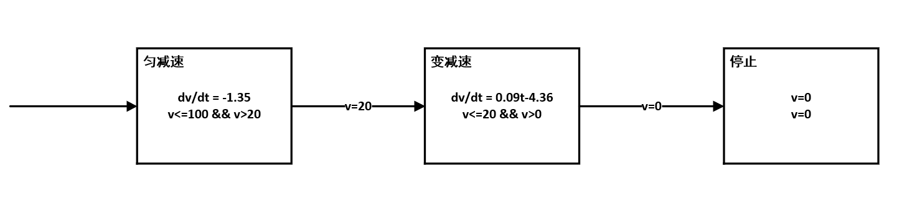
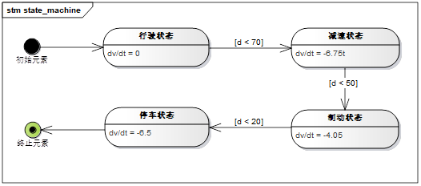
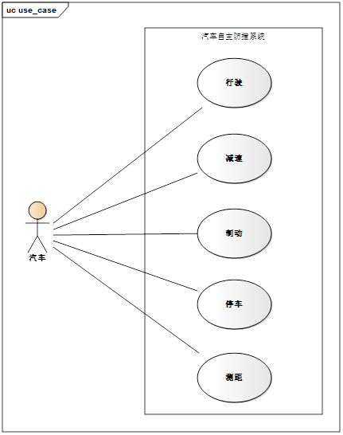
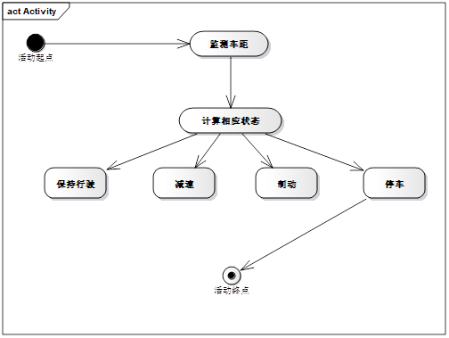
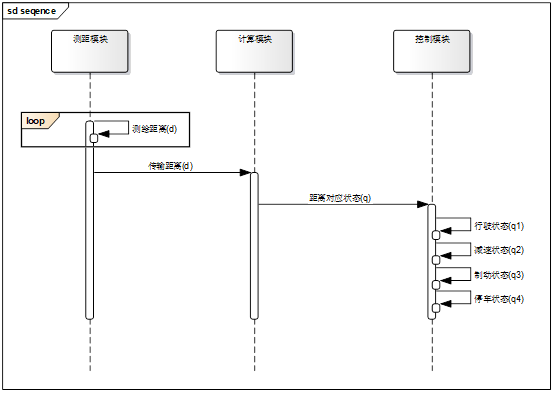
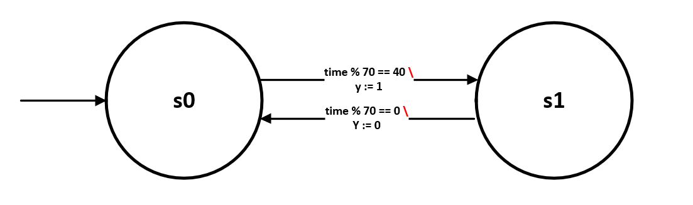
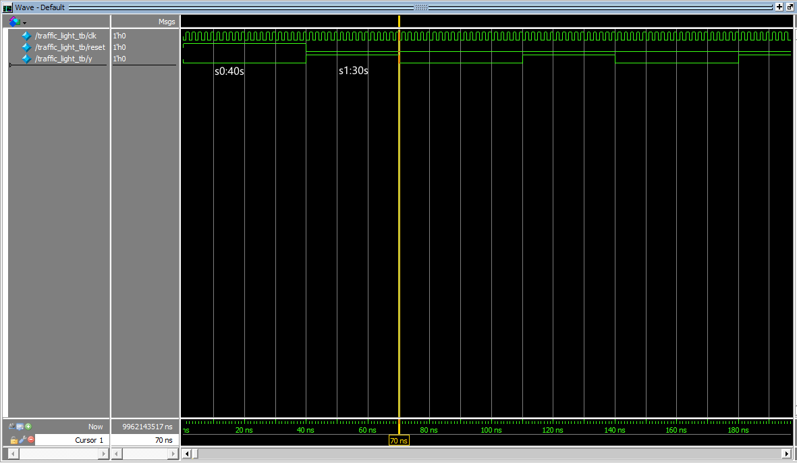

## 第三次作业

### 2.6 汽车自动停车系统的混成自动机模型

**混成自动机模型：**

1、离散状态 Q={匀减速，变减速，停止}；

2、连续状态 V=R，连续变量v代表汽车运动的速度，均减速状态下加速度不变，变减速状态下，加速度是时间t的函数；

3、向量场函数F(**·**，**·**）：{匀减速，变减速，停止} X V -> R : F(匀减速，v）=（dv/dt = -1.35)，F(变减速，v）=（dv/dt = 0.09t - 4.36)，F(停止，v) = (v = 0)；

4、初始状态集 Init：{匀减速} X {v∈R | v=100} 

5、域函数Dom(**·**)：Q->P(V) 定义为：Dom(匀减速) = {v<=100 && v>20} ,Dom(变减速) = {v<=20 && v>0}，Dom(停止) = {v=0}；

6、边集E⊆Q X Q：匀减速->变减速，变减速->停止；

7、转换条件G(**·**)：E -> P(V)，G(匀减速->变减速)={v=20}，G(变减速->停止)={v=0}；

8、重置映射R(**·**，**·**)：E X V -> P(V) : 为每个边都指定了一个空集，即没有重置动作。


注：以上速度单位均为Km/h。




### 2.7 建立汽车自主防撞系统的SysML模型

**汽车自主防撞系统混成自动机模型**

1. 离散状态 Q={q1,q2,q3,q4}  分别为行驶状态，减速状态，制动状态，停车状态

2. 连续状态 X= R<sup>2</sup>，连续变量v代表汽车行驶速度，连续变量d代表系统检测到障碍物与车之间的距离。

3. 向量场函数F（**·**，**·**）：{q1,q2,q3,q4} × X -> R

   F(q1,v,d) = (dv/dt=0),汽车行驶状态匀速前进

   F(q2,v,d) = (dv/dt=-6.75t),汽车减速状态

   F(q3,v,d) = (dv/dt=-4.05),汽车制动状态

   F(q4,v,d) = (dv/dt=-6.5),汽车停车状态

4. 初始状态集 Init ：{q1}  × {v=80，d=∝}

5. 域函数 Dom(**·**): Q -> P(X)定义为：

   Dom(q1)={d>=70}

   Dom(q2)={50<=d && d<70}

   Dom(q3)={20<=d && d<50}

   Dom(q4)={0<=d && d<20}\

6. 边集 E ⊆ Q×Q：q1→q2，q2→q3，q3→q4

7. 转换条件 G(**·**) : E→P(X)：

   G(q1→q2) = {d<70}

   G(q2→q3) = {d<50}

   G(q3→q4) = {d<20}

8. 重置映射 R(**·**,**·**) :  E×X→ P(X)： 为每个边都指定了一个空集，即没有重置动作

注：以上速度单位为Km/h


##### 建立SysML状态机图

状态机图中包括行驶状态、减速状态、停车状态、制动状态。初始状态可到达行驶状态，停止状态之后可到达终止状态，状态之间的转移条件如上。



##### 建立SysML用例图

用例图中参与者为汽车，用例包括行驶、减速、制动、停车以及测速，参与者与以上用例之间都存在控制关系。



##### 建立SysML活动图

活动从系统起点开始，包括监测车距活动以及计算状态活动，计算出状态后对应的行动可以是保持行驶、减速、制动或者停车，只有采取行动停车后，才能够达到系统活动终点。



##### 建立SysML序列图

序列图的推进在测距模块、计算模块以及控制模块之间进行。测距模块负责与前方障碍物的距离测算，由于需要实时的轮询测算，使用loop循环操作符包含，测距模块测得间距后数据传递至计算模块，由计算模块计算出距离相对应的汽车状态，最后由控制模块进行汽车状态的变化控制。




### 3.2 使用Modelsim仿真工具对交通路口红绿灯控制系统进行建模仿真

南北方向绿灯40s，东西方向绿灯30s


状态集 S={s0，s1}  ， s0表示南北方向为绿灯，s1表示东西方向为绿灯。

数据输入集 T={tim}，time使用Verilog中系统函数`$time`表示。

数据输出集Y = {y}，y=0表示南北方向为绿灯，y=1表示东西方向为绿灯。

| 状态迁移 | 转移条件        | 数据输出 |
| -------- | --------------- | -------- |
| s0 -> s1 | time % 70 == 40 | y := 1   |
| s1 -> s0 | time % 70 == 0  | y := 0   |




**modelsim仿真**

`traffic_light.v`

```verilog
module traffic_light 
(
    clk,reset,y
);
input clk,reset;
output y;
reg state;
parameter S0 = 1'b0,S1 = 1'b1;  //S1对应30s，S0对应40s，开始为S0.

always @(posedge reset or posedge clk or negedge clk) 
begin
    if (reset)
        state<=S0;
    else
        case (state)
            S0: if($time%70==40) state=S1;
            S1: if($time%70==0)  state=S0;
        endcase

end

assign y=state;
endmodule //traffic_light
```


`traffic_light_tb.v`

```verilog
`timescale 1ns/1ns

module traffic_light_tb;
reg clk,reset;
wire y;

always #1 clk=~clk;

initial 
begin
    clk=0;
    #0 reset=1;
    #40 reset=0;
    
end

traffic_light
traffic_light(.clk(clk),.reset(reset),.y(y));
endmodule //traffic_light_tb
```


`modelsim图形`



**可见输出信号`y`呈70s有规律的在{0、1}间进行信号灯变换**

